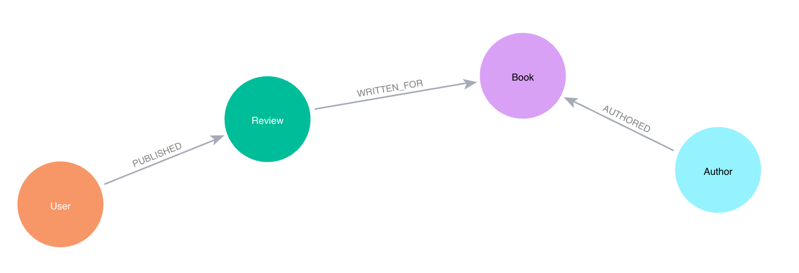

= Spring AI application with Pinecone and Neo4j

This is an example application using Spring AI, Pinecone, Neo4j, and Goodreads book data.

== Data set

Data is maintained and pulled from a public data source. Load scripts and more information is available in https://github.com/JMHReif/graph-demo-datasets/tree/main/goodreadsUCSD[this data set Github repository^]. An example of the data model is shown below.



For this project, we are focusing on how VectorRAG and GraphRAG are similar and different.

== Notes

There were a few "gotchas" I found as I built this application.

1. Create a specific `VectorStore` bean for each database, as letting the autoconfig try to manage it seems to end up with conflicts.

== Running and testing this project

To run the application, you will need the following:

* Neo4j database credentials. You can set these in the `application.properties` file or as environment variables on the machine.
* OpenAI API key: they offer a free tier that works for this.
* Pinecone API key: also offer a free tier that works for this.

Once that's set up and data is loaded, execute the application with `./mvnw spring-boot:run`.

You can test both the `/vectorRAG` and `/graphRAG` endpoints. Here are some ideas for example search phrases:

```
http ":8080/vectorRAG?searchPhrase=dragons"
http ":8080/graphRAG?searchPhrase=dragons"

http ":8080/vectorRAG?searchPhrase=magic"
http ":8080/graphRAG?searchPhrase=magic"

http ":8080/vectorRAG?searchPhrase=encouragement"
http ":8080/graphRAG?searchPhrase=encouragement"

http ":8080/vectorRAG?searchPhrase=dragons and magic"
http ":8080/graphRAG?searchPhrase=dragons and magic"
```

*Note:* The above commands are using the https://httpie.io/[
HTTPie^] command line tool, but you can use `curl` similarly.

== Presentation

PDF versions of accompanying presentations are published to SpeakerDeck.

* https://speakerdeck.com/jmhreif/rag-accuracy-and-explainability-in-genai-applications[Arc of AI (March 2025)^]

== Resources
* Site: https://dev.neo4j.com/aura-java[Neo4j Aura^]
* Online training: https://graphacademy.neo4j.com/categories/llms/[Neo4j GraphAcademy LLM courses^]
* Documentation: https://docs.spring.io/spring-ai/reference/api/vectordbs.html[Spring AI Vector Stores^]
* Documentation: https://docs.pinecone.io/guides/get-started/overview[Pinecone^]
* Documentation: https://platform.openai.com/docs/guides/embeddings[OpenAI Embeddings^]